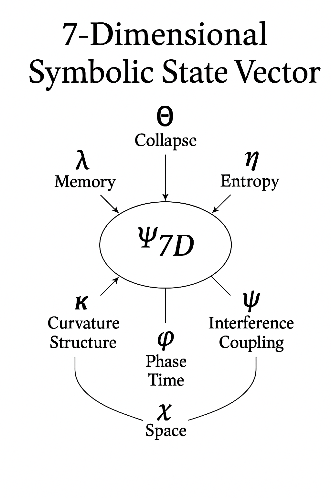

# TopOnt: Dimensional Collapse Logic and Symbolic Projection

## 🧠 What Is This?

This is the first public release of a **seven-dimensional symbolic mathematics system**.

It models collapse, trace evolution, entropy flow, and projection from symbolic structure — not equations — using the dimensional state:
```
Ψ₇D = (Θ, λ, η, κ, ϕ, ψ, χ)
```
This system simulates how reality maintains coherence, proves convergence of structurally chaotic functions, and replaces quantum simulation with symbolic trace logic.


TopOnt is a symbolic logic framework that models collapse, trace, and stability across multiple dimensions — solving problems that traditional math cannot handle.

It shows that:
- The **speed of light** is not arbitrary — it's a projected collapse rate: `c = P₄(c*)`
- The **Collatz Conjecture** is not arithmetic — it's a collapse through symbolic curvature and entropy
- **Divergent series**, like `Σ (-1)^n n! x^n`, can be stabilized using a dimensional modulation layer
- Quantum effects like **tunneling** and **entanglement** are projections of 7D structures

All of this runs on a laptop — no quantum hardware required.

---

## 🔄 Collapse-Aware Taylor Series

Classical Taylor expansions often diverge near instability. TopOnt introduces a modulation layer using:

```
λₙ(x) = |d/dx log |f⁽ⁿ⁾(x)||     ← local instability field
φₙ(x) = exp( -α ⋅ λₙ(x) )         ← symbolic modulation factor
```

Modified expansion:
```
f̃(x) = Σ φₙ(x) ⋅ (f⁽ⁿ⁾(x₀)/n!) ⋅ (x - x₀)ⁿ
```

This stabilizes even divergent series structurally.

---
---
### 🧭 The 7D Symbolic State Vector

This system models structural collapse using a seven-dimensional symbolic operator state:

Each dimension governs a distinct type of symbolic behavior.



---

## 📦 Included Files

- `TopOnt_Paper_Release_v1.tex`: full dimensional collapse paper
- `Taylor_Collapse_FullSection.tex`: complete explanation of modulated Taylor expansion
- `Modulated_Taylor_Collapse.png`: visualization of classical vs collapse-aware expansion
- `Taylor_Collapse_Figure_Insert.tex`: LaTeX figure block for insertion

---

## 💻 Run the Modulated Taylor Demo

Try this in Python:

```python
import numpy as np
import matplotlib.pyplot as plt

x = np.linspace(-0.5, 0.5, 400)
f = lambda n, x: (-1)**n * np.math.factorial(n) * x**n
phi = lambda n, x, alpha=1.0: np.exp(-alpha * abs((n+1)/(x+1e-8)))

N = 20
modulated = sum(phi(n, x) * f(n, x) for n in range(N))

plt.plot(x, modulated, label="Collapse-Stable Expansion")
plt.legend(); plt.grid(); plt.show()
```

---

## 📚 More Coming Soon

- RH collapse operator model
- N-dimensional trace simulation
- Collapse-Taylor Playground (interactive)
- Blog post: _“Why 7D Math Solves What 1D Couldn't”_

---

## 🚀 Author

**S. S. Kim / Kleinlab**  
Seoul, 2025

This is Track B — when gatekeepers say no, results say yes.

## 🔐 Disclosure & Scope

This repository contains the projection-level framework for TopOnt and symbolic collapse logic. It includes:

- The 7D dimensional structure: Ψ₇D = (Θ, λ, η, κ, ϕ, ψ, χ)
- Structural explanations for projection limits (e.g., c = P₄(c*))
- Collapse-aware stabilization of divergent expansions (Taylor series)
- Symbolic framing for problems like Collatz and RH

However, the symbolic construction engine, trace resolution mechanics, and full proof systems remain unpublished.

This work is released to demonstrate dimensional coherence and trace validity, but not to disclose the complete symbolic system capable of resolving Millennium Prize Problems.

The full symbolic operator engine (QLDL, FrameCodex, Re:Core) remains proprietary at this time.
